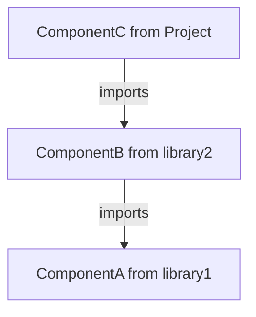

Ontem, passei horas tentando entender um problema que, na verdade, **nem deveria existir** — e o pior: ele só acontecia nos testes.

Eu estava escrevendo um teste para um componente React que importava um componente de uma lib, que por sua vez importava outro de outra lib. A estrutura era mais ou menos assim:



Escrevi um teste simples com [React Testing Library](https://testing-library.com/docs/react-testing-library/intro), apenas para verificar se o conteúdo era renderizado corretamente:

```jsx
test('shows a message', async () => {
  jest.spyOn(window, 'fetch').mockResolvedValue(mockObject)
  render(<ComponentC />)
  await waitForElementToBeRemoved(() => 
    screen.getByRole('alert', { name: /loading/i })
  )
  expect(screen.getByText(/some text/i)).toBeInTheDocument()
})
```

Ao rodar o teste, apareceu este erro:

```
Warning: React.jsx: type is invalid -- expect a string (for built-in components) or class/function (for composite components) but got: undefined. You likely forgot to export your component from the file it's defined in, or you might have mixed up default and named imports. Check the render method of ComponentB.
```

Fiquei um bom tempo focado no `ComponentB`. Revisei o código da lib onde ele estava, olhei o `jest.config.js` para ver se havia algum mock nas configurações, verifiquei se o `mockObject` estava no formato correto... e estava tudo certo. Então por que esse erro acontecia **apenas no teste**?

No fim das contas, o detalhe estava bem na minha frente — no próprio arquivo de testes:

```javascript
jest.mock('library1', () => ({
  useSomething: jest.fn(),
}))
```

A `library1`, usada pela `library2`, estava sendo completamente mockada, substituída por um objeto que simulava apenas um hook. Isso tinha sido feito para cobrir um caso específico de teste.

Parece simples de resolver (e realmente é), mas eu **nem imaginava que a `libraryA`, usada indiretamente pela `libraryB`, estava sendo mockada diretamente**.

Para piorar, o arquivo tinha quase **800 linhas**, com vários mocks, funções "utilitárias", `beforeEach`, `afterEach`… um monte de coisas feitas pra “reaproveitar” código, mas que, na prática, deixavam os testes difíceis de entender e com **acoplamento desnecessário** (tema para outro post, talvez).

A solução foi importar todos os módulos reais da `library1` e sobrescrever apenas o hook que eu precisava mockar:

```javascript
jest.mock('library1', () => ({
  ...jest.requireActual('library1'),
  useSomething: jest.fn(),
}))
```

Depois de muito tempo perdido com um problema que poderia ter sido evitado com boas práticas de testes, o erro foi resolvido.

Essa é a única forma de resolver? **Não.**

É a melhor? **Talvez também não.**

Mas como eu disse… esse é papo pra outro post. 😅
